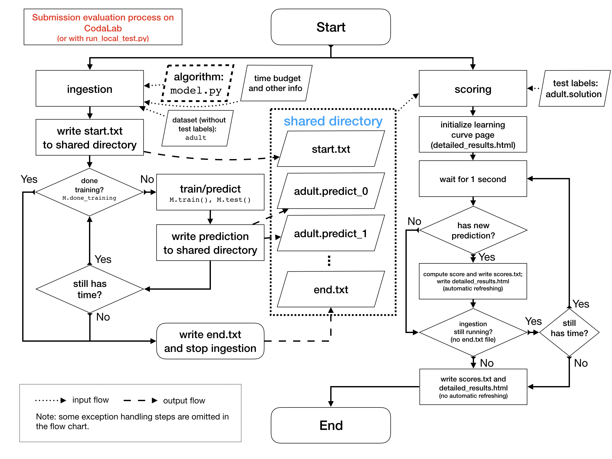

AutoCV/AutoDL starting kit
======================================

ALL INFORMATION, SOFTWARE, DOCUMENTATION, AND DATA ARE PROVIDED "AS-IS".
UNIVERSITE PARIS SUD, INRIA, CHALEARN, AND/OR OTHER ORGANIZERS
OR CODE AUTHORS DISCLAIM ANY EXPRESSED OR IMPLIED WARRANTIES.

## Download this starting kit

You can download this starting kit by clicking on the green button
"Clone or download" on top of
[this GitHub repo](https://github.com/zhengying-liu/autodl_starting_kit_stable),
then "Download ZIP". You'll have this whole starting kit by unzipping the
downloaded file.

Another convenient way is to use **git clone**:
```
cd <path_to_your_directory>
git clone https://github.com/zhengying-liu/autodl_starting_kit_stable.git
```
(If you are an experienced user of GitHub, feel free to
[fork this repo](https://help.github.com/en/articles/fork-a-repo) and
clone your own repo instead)

Then you can begin participating to the AutoCV/AutoDL challenge by carefully
reading this README.md file.

## Update this starting kit

As new features and possible bug fixes will be constantly added to this starting
kit, you are invited to get latest updates **before each usage** by running
```
cd path/to/autodl_starting_kit_stable/
git pull
```
(or by [syncing your fork](https://help.github.com/en/articles/syncing-a-fork)
if you forked this repo)

## Local development and testing
To make your own submission to AutoCV/AutoDL challenge, you need to modify the
file `model.py` in `AutoDL_sample_code_submission/`, which implements the logic
of your algorithm. You can then test it on your local computer using Docker,
in the exact same environment as on the CodaLab challenge platform. Advanced
users can also run local test without Docker, if they install all the required
packages,
see the [Dockerfile](https://github.com/zhengying-liu/autodl/blob/master/docker/Dockerfile).

If you are new to docker, install docker from https://docs.docker.com/get-started/.
Then, at the shell, run:
```
cd path/to/autodl_starting_kit_stable/
docker run -it -v "$(pwd):/app/codalab" -p 8888:8888 evariste/autodl:cpu-latest
```
The tag `cpu-latest` indicates that this image only supports usage of CPU (instead of
GPU). The option `-v "$(pwd):/app/codalab"` mounts current directory
(`autodl_starting_kit_stable/`) as `/app/codalab`. If you want to mount other
directories on your disk, please replace `$(pwd)` by your own directory.
The option `-p 8888:8888` is useful for running a Jupyter notebook tutorial
inside Docker.

The backend on CodaLab runs a slightly different Docker image
```
evariste/autodl:gpu-latest
```
who has Nvidia GPU supports. Both Docker images have `python=3.5.2` and have
installed packages such as
`tensorflow-gpu=1.13.1` (or `tensorflow=1.13.1` for `cpu`), `torch=1.3.1`,
`keras=2.2.4`, CUDA 10, cuDNN 7.5, etc. If you want to
run local test with Nvidia GPU support, please make sure you have
[installed nvidia-docker](https://github.com/NVIDIA/nvidia-docker) and run
instead
```
nvidia-docker run -it -v "$(pwd):/app/codalab" -p 8888:8888 evariste/autodl:gpu-latest
```

Make sure you use enough RAM (**at least 4GB**). If the port 8888 is occupied,
you can use other ports, e.g. 8899, and use instead the option `-p 8899:8888`.

You will then be able to run the `ingestion program` (to produce predictions)
and the `scoring program` (to evaluate your predictions) on toy sample data.
In the AutoCV/AutoDL challenge, these two programs will run in parallel to give
real-time feedback (with learning curves). So we provide a Python script to
simulate this behavior:
```
python run_local_test.py
```
Then you can view the real-time feedback with a learning curve by opening the
HTML page in `AutoDL_scoring_output/`.

The full usage is
```
python run_local_test.py -dataset_dir='AutoDL_sample_data/miniciao' -code_dir='AutoDL_simple_baseline_models/linear'
```
or
```
python run_local_test.py -dataset_dir='AutoDL_public_data/Munster' -code_dir='AutoDL_sample_code_submission'
```
You can change the argument `dataset_dir` to other datasets (e.g. the five
public datasets we provide). On the other hand,
you can also modify the directory containing your other sample code
(`model.py`).

## Run the tutorial
We provide a tutorial in the form of a Jupyter notebook. When you are in your
docker container, enter:
```
jupyter-notebook --ip=0.0.0.0 --allow-root &
```
Then copy and paste the URL containing your token. It should look like something
like that:
```
http://0.0.0.0:8888/?token=82e416e792c8f6a9f2194d2f4dbbd3660ad4ca29a4c58fe7
```
and select `tutorial.ipynb` in the menu.

## Download public datasets
We provide several public datasets for participants. They can use these datasets to:
1. Explore data (e.g. using `data_browser.py`, see next section);
2. Do local test for their own algorithm;
3. Enable meta-learning.
These datasets can be downloaded on the competition website and we also provide
a script to facilitate the data downloading process. The usage
is:
```bash
python download_public_datasets.py
```
Note that this can take a few minutes, depending on your connection.

## Visualize datasets
*WARNING: to be run outside of a Docker container.*

We provide a script for visualizing random examples of a given dataset:
```bash
python data_browser.py -dataset_dir=AutoDL_sample_data/miniciao
```
You can change the dataset name `miniciao` to that of any other dataset
(e.g. `Munster`, `Chucky`, `Pedro`, etc.).

As all datasets are formatted into
[TFRecords](https://www.tensorflow.org/tutorials/load_data/tf_records),
this script actually provides a way to easily see what their
code receives as examples (and labels), especially for the participants who
are not familiar with this format.

## Understand how a submission is evaluated

You may have following questions:
- How is a submission handled and evaluated on CodaLab? How is it implemented?
- What are ingestion program and scoring program? What do they do?

To answer these questions, you
can find a flow chart (`evaluation-flow-chart.png`) in the repo:



If you still want more details, you can refer to the source code at
- Ingestion Program: `AutoDL_ingestion_program/ingestion.py`
- Scoring Program: `AutoDL_scoring_program/score.py`


## Prepare a ZIP file for submission on CodaLab
Zip the contents of `AutoDL_sample_code_submission`(or any folder containing
your `model.py` file) without the directory structure:
```
cd AutoDL_sample_code_submission/
zip -r mysubmission.zip *
```
then use the "Upload a Submission" button to make a submission to the
competition page on CodaLab platform.

Tip: to look at what's in your submission zip file without unzipping it, you
can do
```
unzip -l mysubmission.zip
```

## Report bugs and create issues

If you run into bugs or issues when using this starting kit, please create
issues on the
[*Issues* page](https://github.com/zhengying-liu/autodl_starting_kit_stable/issues)
of this repo. Two templates will be given when you click the **New issue**
button.

## Contact us
If you have any questions, please contact us via:
<autodl@chalearn.org>
